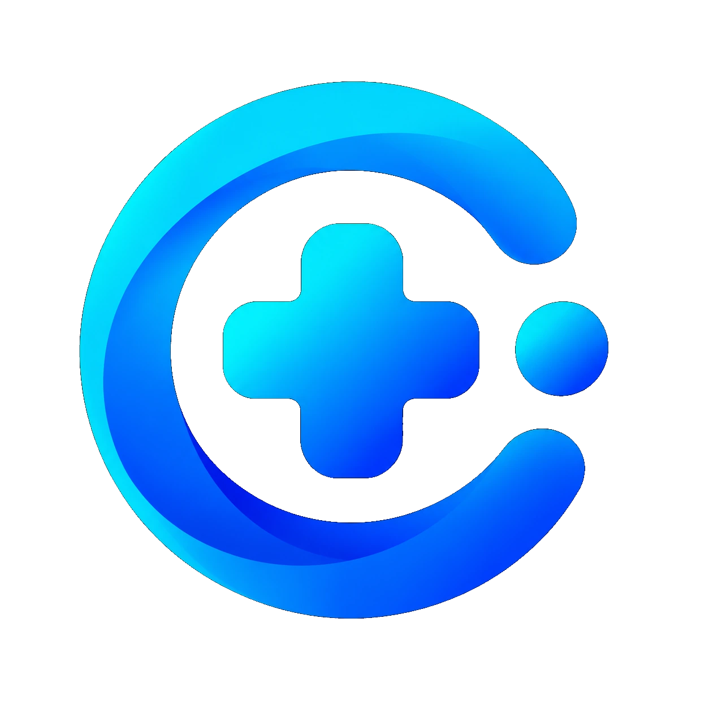
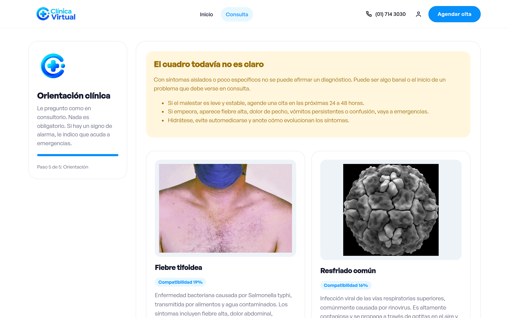

<a id="readme-top"></a>


<p align="center">
  &nbsp;
  &nbsp;
  &nbsp;
  &nbsp;
</p>

<br>

<div align="center">
  
  <h3 align="center">Clínica Virtual</h3>
  <p align="center">
    Orientación médica inicial guiada como en consultorio. El paciente cuenta el motivo, los síntomas y los antecedentes; el sistema sugiere hipótesis, cita o emergencias.
    <br>
    <a href="https://github.com/hexed-AAL1X/SympoTrack"><strong>Explorar repositorio »</strong></a>
    <br><br>
    <a href="https://github.com/hexed-AAL1X/SympoTrack">Ver código</a>
    ·
    <a href="https://github.com/hexed-AAL1X/SympoTrack/issues/new?labels=bug">Reportar bug</a>
    ·
    <a href="https://github.com/hexed-AAL1X/SympoTrack/issues/new?labels=enhancement">Pedir feature</a>
  </p>
</div>

<details>
  <summary>Tabla de contenidos</summary>
  <ol>
    <li><a href="#about-the-project">About the project</a></li>
    <li><a href="#built-with">Built with</a></li>
    <li><a href="#important-notices">Important notices</a></li>
    <li>
      <a href="#getting-started">Getting started</a>
      <ul>
        <li><a href="#prerequisites">Prerequisites</a></li>
        <li><a href="#installation">Installation</a></li>
        <li><a href="#available-scripts">Available scripts</a></li>
      </ul>
    </li>
    <li>
      <a href="#contributing">Contributing</a>
      <ul>
        <li><a href="#top-contributors">Top contributors</a></li>
      </ul>
    </li>
    <li><a href="#contact">Contact</a></li>
  </ol>
</details>
<br>

<a id="about-the-project"></a>***About the project***


<p align="center">
  
</p>

**Clínica Virtual** (SympoTrack) es una primera orientación clínica: no es un formulario rígido ni un diagnóstico médico. El flujo pregunta como en consultorio.

- **Motivo principal**: piel, fiebre, respiración, digestión, orina, dolor, circulación o conciencia. Si no aparece, existe *Mi síntoma no está acá*.
- **Síntomas dirigidos**: se marcan solo los que reconocen; nada es obligatorio.
- **Antecedentes**: medicamento nuevo, sustancias, alcohol, contacto de riesgo, transfusión o inyección no estéril.
- **Orientación clara**: hipótesis compatibles, cita en 24–48 h o paso a emergencias si hay alarma.
- **Motor probabilístico**: FastAPI + grafo de enfermedades/síntomas e inferencia sobre el dataset clínico.

<p align="right">(<a href="#readme-top">back to top</a>)</p>

<a id="built-with"></a>***Built with***


- 
- 
- 
- 
- 
- 

<p align="right">(<a href="#readme-top">back to top</a>)</p>

<a id="important-notices"></a>***Important notices***


> [!NOTE]
> Esta aplicación **no reemplaza** una consulta presencial ni una emergencia. Es orientación inicial.

> [!IMPORTANT]
> Para usar la app basta el frontend: el motor Naive Bayes viaja en el build. La API FastAPI es opcional (desarrollo o un servidor propio).

> [!WARNING]
> Si aparecen falta de aire, dolor de pecho, vómitos persistentes o confusión, la indicación es acudir a emergencias, no seguir en la app.

<p align="right">(<a href="#readme-top">back to top</a>)</p>

<a id="getting-started"></a>***Getting started***

<a id="prerequisites"></a>

### Prerequisites

- Python 3.12+
- Node.js 18+
- npm
- pip

<a id="installation"></a>

### Installation

1) Clonar el repositorio

```bash
git clone https://github.com/hexed-AAL1X/SympoTrack.git
cd SympoTrack
```

2) Frontend (suficiente para correr y para Vercel)

```bash
cd frontend/SymptoTrack
npm install
npm run dev -- --host 127.0.0.1 --port 5173
```

Desde la raíz también: `npm run dev`.

3) Abrir la consulta

- Inicio: `http://127.0.0.1:5173/`
- Consulta: `http://127.0.0.1:5173/consulta`

4) Publicar en Vercel

- Root Directory: `frontend/SymptoTrack`
- Build: `npm run build`
- Output: `dist`
- No hace falta `VITE_API_URL`

5) API opcional (si quiere FastAPI aparte)

```bash
python -m venv .venv
source .venv/bin/activate
pip install -r requirements.txt
.venv/bin/uvicorn backend.main:app --host 127.0.0.1 --port 8000
```

Si cambia el dataset o el catálogo: `npm run export-engine` en la raíz.

<a id="available-scripts"></a>

### Available scripts

```bash
# Desde la raíz
npm run dev            # UI + motor en :5173
npm run build          # build estático para Vercel
npm run export-engine  # regenera src/engine/engine.json
npm run api            # FastAPI opcional en :8000
```

**Flujo de la consulta:**

| Paso | Qué se pregunta |
|------|-----------------|
| Motivo | Qué molesta hoy, o *Mi síntoma no está acá* |
| Síntomas | Los que reconoce en esa categoría |
| Antecedentes | Medicamento, sustancia, alcohol, riesgo |
| Otros | Búsqueda opcional en español |
| Orientación | Hipótesis, cita o emergencias |

<p align="right">(<a href="#readme-top">back to top</a>)</p>

<a id="contributing"></a>***Contributing***


Contribuciones bienvenidas.

1) Fork del proyecto
2) Crear una rama (`git checkout -b feature/nueva-feature`)
3) Commit (`git commit -m "Add: ..."`)
4) Push (`git push origin feature/nueva-feature`)
5) Pull Request

<a id="top-contributors"></a>

### Top contributors

<div align="center">

<table>
  <tr>
    <td align="center" width="160">
      <a href="https://github.com/Ray-Alessandro">
        <br />
        <b>Ray Alessandro</b><br />
        <sub>@Ray-Alessandro · he/him</sub>
      </a>
    </td>
  </tr>
</table>

</div>

<p align="right">(<a href="#readme-top">back to top</a>)</p>

<a id="contact"></a>***Contact***


<p align="center">
  <a href="mailto:hexed_aal1x.ops@proton.me"></a>
  <a href="https://www.instagram.com/hexed_aal1x"></a>
  <a href="https://www.linkedin.com/in/leonardo-bravo-4120b8228/"></a>
</p>

<p align="right">(<a href="#readme-top">back to top</a>)</p>
